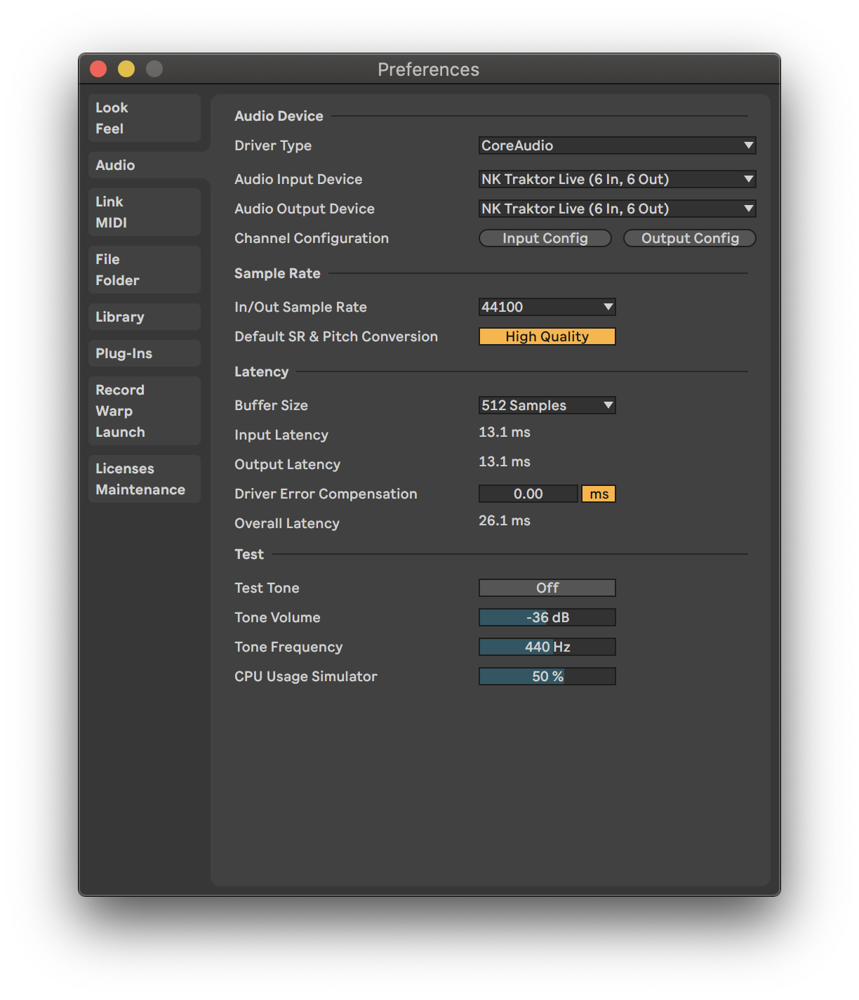
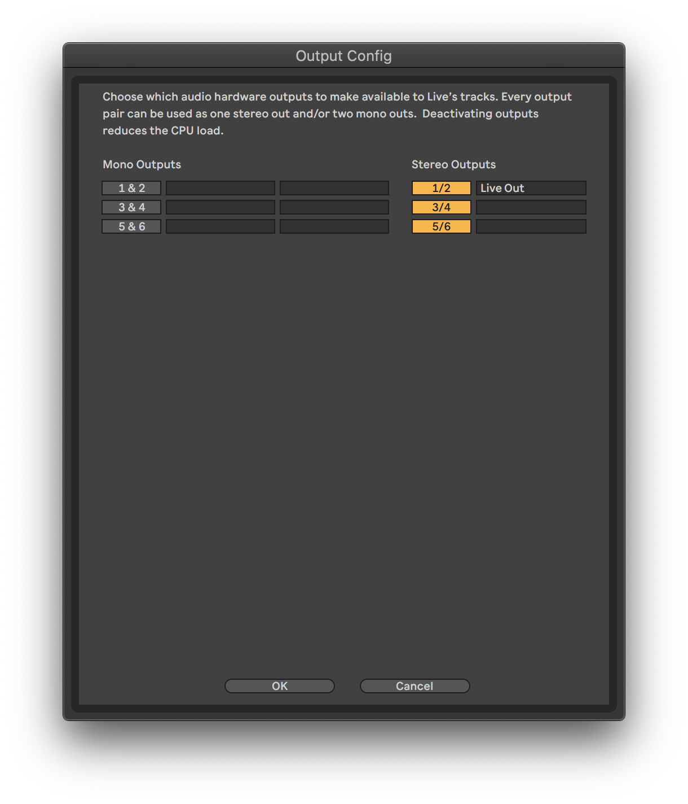
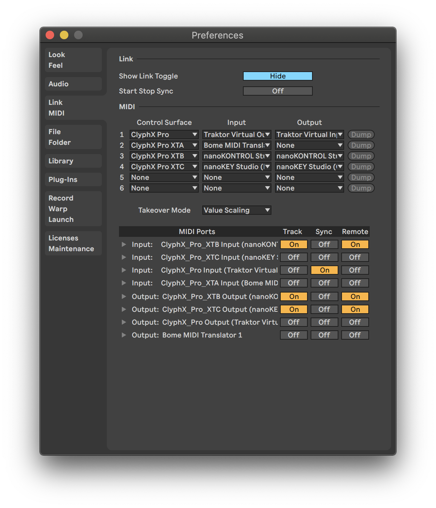

# NK Traktor Live

 

Traktor Pro mix template for the KORG nanoKEY/nanoKONTROL Studio MIDI controllers.

Includes Ableton Live starter file with mixer and 4 channel sampler.

I've documented this for my own benefit, but please help yourself to any part you find useful.

---

## Purpose

The purpose of this setup is to replace Traktor Pro’s Remix Decks and Loop Recorder with Ableton Live.

### Replace Traktor Pro’s Remix Decks

Traktor Pro’s Remix Decks mostly work fine when resampling directly from a deck.

However when keylock pitching is used, the recorded pitch often does not match the source deck.

### Replace Traktor Pro’s Loop Recorder

To capture global FX like reverb and gating, Traktor Pro’s Loop Recorder must be used.

The Loop Recorder is problematic because it records loops slightly too long. Samples glitch on repeat and drift out of sync with the source material.

---

## Components

1. **[Physical Sound Card](#1-physical-sound-card):**
    * Macbook Pro (15-inch, 2018 / macOS v10.15.7)
    * External Headphones (headphones or [Minirig](https://www.minirig.co.nz/) plugged into headphone jack)
2. **[Virtual Sound Card](#2-virtual-sound-card):**
    * [Rogue Amoeba Loopback](#rogue-amoeba-loopback)
3. **[DJ Decks and MIDI Clock](#3-dj-application-and-midi-clock):**
    * [Native Instruments Traktor Pro](#native-instruments-traktor-pro)
4. **[Mixer and Sampler](#4-mixer-and-sampler):**
    * [Ableton Live](#ableton-live)
    * [Plugins](#plugins)
5. **[Controller Mapping](#5-controller-mapping):**
    * [Bome Midi Translator Pro](#bome-midi-translator-pro)
    * [KORG KONTROL Editor](#korg-kontrol-editor)
    * [KORG nanoKEY Studio](#korg-nanokey-studio)
    * [KORG nanoKONTROL Studio](#korg-nanokontrol-studio)
    * [nativeKONTROL ClyphX Pro](#nativekontrol-clyphx-pro)
    * [Native Instruments Traktor Pro Controller Manager](#native-instruments-traktor-pro-controller-manager)
6. **[Controller Overlay](#6-controller-overlay):**
    * [Inkscape](#inkscape)
    * [Cricut](#cricut)
7. **[Mix Recorder](#7-mix-recorder):**
    * [Rogue Amoeba Audio Hijack](#rogue-amoeba-audio-hijack)
8. **[Launch Script](#8-launch-script):**
    * [Apple Script Editor](#applescripteditor)
9. **[Further Reading](#9-further-reading)**
    * [FAQs](#faqs)
    * [References](#references)

---

### 1. Physical Sound Card

#### MacBook Pro

This setup is for the internal sound card on my Macbook Pro.

As my Native Instruments Z1 is in storage, the output goes directly to headphones and there is no separate output for cueing.

---

### 2. Virtual Sound Card

#### Rogue Amoeba Loopback

* Product: <https://rogueamoeba.com/loopback/>
* Version: 2

Loopback allows additional stereo pairs to be added to an existing sound card. These pairs can then be used for internal routing via input and output settings in Traktor Pro and Ableton Live.

Some web tutorials use Jack Audio instead. I prefer Loopback’s routing UI.

##### Project file

* `loopback/Devices.plist`

Automatically loaded by the app.

In order to be able to choose which Traktor Pro deck to sample from, both decks are routed to Ableton Live.

---

### 3. DJ Application and MIDI Clock

#### Native Instruments Traktor Pro

* Product: <https://www.native-instruments.com/en/products/traktor/dj-software/traktor-pro-3/>
* Version: 3.4.2

---

### 4. Mixer and Sampler

#### Ableton Live

* Product: <https://www.ableton.com/en/live/>
* Version: 10

##### Project file

1. `ableton-live/traktor-live Project/traktor-live.als`

Contains a 4 channel mixer and a 4 channel sampler.

Automatically loaded by the AppleScript app, otherwise double-click to load.

##### Audio

1. Driver Type: `CoreAudio`
2. Audio Input Device: `NK Traktor Live (6 In, 6 Out)`
3. Audio Output Device: `NK Traktor Live (6 In, 6 Out)`
4. Channel Configuration
   1. Input Config:
      * `3/4: Traktor Pro Deck A`
      * `5/6: Traktor Pro Deck B`
   2. Output Config:
      * `1/2: Live Out`

##### UI (top left)

1. Click `Ext` so that it lights up - Ableton Live will now follow the Sync source (Traktor Pro Virtual Output) - the AppleScript app does this automatically
2. Global launch quantisation: `None` (punching in exactly when you want seems most reliable)

##### Plugins

1. [A1TriggerGate](https://a1audio.alexhilton.net/a1triggergate) (v1.4)

---

### 5. Controller Mapping

#### Bome MIDI Translator Pro

* Product: <https://www.bome.com/products/miditranslator>
* Version: 1.9.0

Bome MIDI Translator Pro is used to filter the MIDI messages sent by controllers, before they reach Ableton Live.

1. Channels 1-8: Split encoder value range across 3 channels
2. Channels 1-4 `SELECT`: Focus Traktor Pro
3. Channels 5-8 `SELECT`: Focus Ableton Live

##### Project files

1. MIDI filters:
    1. `bome-midi-translator-pro/nanoKONTROL Studio.bmtp`
2. Application settings:
    1. `bome-midi-translator-pro/settings.bmts`

The `.bmtp` file is Automatically loaded by the AppleScript app, otherwise double-click to load.

##### Ableton Live MIDI setup

* Control Surface: `ClyphX Pro XTA`
* Input: `Bome MIDI Translator 1`
  * Track: `Off`
  * Sync: `Off`
  * Remote: `Off`
* Output: `None`

##### nativeKONTROL ClyphX Pro configuration files

1. `X-Controls.txt`
    * Source: `clyphx-pro/ClyphX_Pro/XTA/X-Controls.txt`
    * Target: `/Users/You/NativeKONTROL/ClyphX_Pro/XTA/X-Controls.txt`

These map MIDI controls to Ableton Live's interface and provide LED feedback.

I [symlink](https://gist.github.com/dotherightthing/3cbf17fe882dc8131eb8e9b9a501e9b9) the target files to the source files, but you can simply copy them over the top.

---

#### KORG KONTROL Editor

* Product: <https://www.korg.com/us/support/download/software/1/133/1355/>

Control surface editor.

---

#### KORG nanoKEY Studio

* Product: <https://www.korg.com/us/products/computergear/nanokey_studio/>
* Version: 1.08

##### Ableton Live MIDI setup

* Control Surface: `ClyphX Pro XTC`
* Input: `nanoKEY Studio`
  * Track: `On`
  * Sync: `Off`
  * Remote: `On`
* Output: `nanoKEY Studio`
  * Track: `On`
  * Sync: `Off`
  * Remote: `On`

##### KORG KONTROL Editor configuration files

1. Set: `korg-kontrol-editor/nk-traktor-live.nanokey_st_set`
2. Data: `korg-kontrol-editor/nk-traktor-live.nanokey_st_data`

Double-click to open the set files, then select Communication > Write Scene Data.

##### nativeKONTROL ClyphX Pro configuration files

1. `Encoder Bindings.txt`
    * Source: `clyphx-pro/ClyphX_Pro/XTC/Encoder Bindings.txt`
    * Target: `/Users/You/NativeKONTROL/ClyphX_Pro/XTC/Encoder Bindings.txt`

These map MIDI controls to Ableton Live's interface and provide LED feedback.

I [symlink](https://gist.github.com/dotherightthing/3cbf17fe882dc8131eb8e9b9a501e9b9) the target files to the source files, but you can simply copy them over the top.

---

#### KORG nanoKONTROL Studio

* Product: <https://www.korg.com/us/products/computergear/nanokontrol_studio/>
* Version: 1.05

##### Ableton Live MIDI setup

* Control Surface: `ClyphX Pro XTB`
* Input: `nanoKONTROL Studio`
  * Track: `On`
  * Sync: `Off`
  * Remote: `On`
* Output: `nanoKONTROL Studio`
  * Track: `On`
  * Sync: `Off`
  * Remote: `On`

##### KORG KONTROL Editor configuration files

1. Set: `korg-kontrol-editor/nk-traktor-live.nktrl_st_data`
2. Data: `korg-kontrol-editor/nk-traktor-live.nktrl_st_data`

Double-click to open the set files, then select Communication > Write Scene Data.

##### nativeKONTROL ClyphX Pro configuration files

1. `Button Bindings.txt`
    * Source: `clyphx-pro/ClyphX_Pro/XTB/Button Bindings.txt`
    * Target: `/Users/You/NativeKONTROL/ClyphX_Pro/XTB/Button Bindings.txt`
2. `Encoder Bindings.txt`
    * Source: `clyphx-pro/ClyphX_Pro/XTB/Encoder Bindings.txt`
    * Target: `/Users/You/NativeKONTROL/ClyphX_Pro/XTB/Encoder Bindings.txt`
3. `G-Controls.txt`
    * Source: `clyphx-pro/ClyphX_Pro/XTB/G-Controls.txt`
    * Target: `/Users/You/NativeKONTROL/ClyphX_Pro/XTB/G-Controls.txt`
4. `X-Controls.txt`
    * Source: `clyphx-pro/ClyphX_Pro/XTB/X-Controls.txt`
    * Target: `/Users/You/NativeKONTROL/ClyphX_Pro/XTB/X-Controls.txt`

These map MIDI controls to Ableton Live's interface and provide LED feedback.

I [symlink](https://gist.github.com/dotherightthing/3cbf17fe882dc8131eb8e9b9a501e9b9) the target files to the source files, but you can simply copy them over the top.

The following files cannot be symlinked and need to be manually copied over:

1. `SelectedTrackLedStates.py`
    * Source: `nk-traktor-live/clyphx-pro/user_actions/SelectedTrackLedStates.py`
    * Target: `/Applications/Ableton Live 10 Standard.app/Contents/App-Resources/MIDI Remote Scripts/ClyphX_Pro/clyphx_pro/user_actions/SelectedTrackLedStates.py`
1. `SelectTraktor ProDeck.py`
    * Source: `nk-traktor-live/clyphx-pro/user_actions/SelectTraktor ProDeck.py`
    * Target: `/Applications/Ableton Live 10 Standard.app/Contents/App-Resources/MIDI Remote Scripts/ClyphX_Pro/clyphx_pro/user_actions/SelectTraktor ProDeck.py`

---

#### nativeKONTROL ClyphX Pro

* ClyphX Pro
  * Product: <https://isotonikstudios.com/product/clyphx-pro/>
  * Version: 1.2.0
* ClyphX Pro Ableton Live Hotfix:
  * Product: <https://forum.nativekontrol.com/post/21021>
* ClyphX Pro Bindings
  * Product: <https://isotonikstudios.com/product/clyphx-pro-bindings/>
* ClyphX Pro G-Controls
  * Product: <https://forum.nativekontrol.com/thread/3906/beta-controls-accessory-clyphx-pro>

The default ClyphX Pro 'controller' is primarily used to sync MIDI clock between Traktor Pro and Ableton Live.

Additionally, ClyphX Pro is sometimes used to send scripted MIDI messages to Traktor Pro. When this is done, channel `16` is used to make it clear that Traktor Pro is being targetted.

Note: `MIDI Clock Sync Delay` was initially set using Traktor Pro's internal mixer, with *Cue out* used to sync Traktor Pro and Ableton Live's metronomes. Ableton Live now functions as the external mixer and syncing does not appear to be an issue anymore.

##### Ableton Live MIDI setup

* Control Surface: `ClyphX Pro`
* Input: `Traktor Pro Virtual Output`
  * Track: `Off`
  * Sync: `On`
  * Remote: `Off`
* Output: `Traktor Pro Virtual Input`
  * Track: `Off`
  * Sync: `Off`
  * Remote: `Off`
* Takeover Mode: Value Scaling

##### nativeKONTROL ClyphX Pro configuration files

1. `Macros.txt`
    * Source: `clyphx-pro/ClyphX_Pro/Macros.txt`
    * Target: `/Users/You/NativeKONTROL/ClyphX_Pro/Macros.txt`
2. `Preferences.txt`
    * Source: `clyphx-pro/ClyphX_Pro/Preferences.txt`
    * Target: `/Users/You/NativeKONTROL/ClyphX_Pro/Preferences.txt`
3. `Variables.txt`
    * Source: `clyphx-pro/ClyphX_Pro/Variables.txt`
    * Target: `/Users/You/NativeKONTROL/ClyphX_Pro/Variables.txt`

These map MIDI controls to Ableton Live's interface and provide LED feedback.

I [symlink](https://gist.github.com/dotherightthing/3cbf17fe882dc8131eb8e9b9a501e9b9) the target files to the source files, but you can simply copy them over the top.

---

#### Native Instruments Traktor Pro Controller Manager

Part of Traktor Pro 3: <https://support.native-instruments.com/hc/en-us/articles/209590569-How-to-Use-the-Controller-Manager-in-TRAKTOR>

Various `.tsi` templates map the control surfaces and supporting software to Traktor Pro's interface / API.

##### Project file

1. Preferences > Import > `traktor-pro/nk-traktor-live.tsi`

##### Miscellaneous settings

* Offset: `0 Ms` (top of mixer section)

---

### 6. Controller Overlay

The worst part about customising generic MIDI controllers is remembering what everything does.

This situation can easily be resolved with sticky labels, but these become incorrect if you switch to different software.

Another option is to use a dynamic interface on e.g. an iPad. But while this liberates you from the laptop screen, it leaves you staring at the iPad's screen instead - you don't want that finger to inadvertedly slide off the control in the middle of a mix!

So I created physical overlays for my physical controllers. These can be switched out quickly. They look nice and they are great for protoyping and memory retention.

Note: You can also buy physical overlays online, *if* they make them for your controller and *if* you are ok with the carbon footprint of getting small packages sent from the other side of the world (I live in New Zealand).

#### Process overview

The process to generate an overlay is as follows:

1. Extract SVG files from owner manuals (bundled Inkscape SVGs)
2. Load the SVGs into cutting machine software
3. Identify the 'pen' versus 'cut' lines
4. Precision draw/cut the file using a cutting machine
5. Peel the cut card off the cutting mat and the cut sections will separate
6. Handwrite text labels describing what each control does
7. Remove any blocking controls (e.g. fader handles) from the controller
8. Slide the overlay over the top of the controller
9. I also cut a plastic sheet to protect the cut card(s) below
10. Reattach any blocking controls onto the controller

My cutting machine does have a pen attachment, but I use this sparingly as 'pen' lines for text labels add complexity to the file and dramatically increase loading times.

When I have nailed down the functionality, I'll do a 'print and cut' - printing the labels and patterns at a print shop, then cutting the holes for the controls.

#### Inkscape

* Product: <https://inkscape.org/>
* Version: 1.0.2

Inkscape is a cross-platform vector editor.

##### Project files

1. KORG nanoKEY Studio
    * Owner manual: <https://www.korg.com/us/support/download/manual/0/551/2967/>
    * SVG: `svg-overlays/nanokey-inkscape.svg`
2. KORG nanoKONTROL Studio
    * Owner manual: <https://www.korg.com/us/support/download/manual/0/552/2911/>
    * SVG: `svg-overlays/nanokontrol-inkscape.svg`

##### Process to create the bundled SVG

After locating and downloading the owner manuals, I optimised the vector graphics to create reliable cut files:

1. File > Import
    1. Select page
    2. Internal import
    3. Uncheck 'replace fonts & embed images'
    4. Precision: 2.0 (default)
2. Fix dimensions
    1. Select objects on page
    2. `COMMAND + G` to group
    3. Transform > Scale
    4. Set width and height to the dimensions in the owner manual
    5. Scale proportionally
3. Outline the physical controls
    1. View > Display mode > Outline
    2. Double-click parts to edit them directly
    3. Use `+`/`-` to zoom in/out
    4. Click near letters, click inside shapes
    5. Use `delete` to delete lines that won't be cut
    6. Use node editing tools to ensure that cut paths are unbroken
4. Edit objects
    1. Object > Objects...
    2. Maximise the panel (close other panels)
    3. Click 3D rectangle layer icon to select that object
    4. Select all g... objects and ungroup them
    5. Delete all g... layers (empty groups)
    6. Optimise one of each individual control (e.g. channel strip)
    7. Group each individual control
    8. Use guides to position copies of these in their original positions
5. Export SVG

#### Cricut

* Cricut Maker
  * Product: <https://cricut.com/en_us/machines/cricut-maker-machines/cricut-maker.html>
  * Version: 2017
* Cricut Design Space
  * Product: <https://design.cricut.com/>
  * Version: 6.12.227

The Cricut Maker is a consumer level cutting machine.

Cricut Design Space is the companion software for the Cricut range.

##### Process to cut the SVG

1. Launch Cricut Design Space
2. Import bundled SVG
3. Mark each object as 'pen' (draw) or 'cut' (cut)
4. Select top level group > Attach (to print the layout as you intended)
5. Select top level group > Set dimensions to match Inkscape file
6. Wait a long time for the project to load
7. Load the mat and cardboard into the machine
8. Draw the 'pen' lines
9. Cut the 'cut' lines

---

### 7. Mix Recorder

#### Rogue Amoeba Audio Hijack

* Product: <https://rogueamoeba.com/audiohijack/>
* Version: 3

While Ableton Live can be used to record the evolving mix and any automation, the playback head jumps to the beginning of the arrangement timeline when Traktor Pro is requested to send a Master Clock Sync message to Ableton Live.

This runs the risk of overwriting existing audio later in the mix.

One solution is to use an external recording app, however free macOS apps provide limited control over what can be recorded.

For example, Quicktime can't distinguish between the individual channels used by the Loopback device, while [Audacity can only record all of them at once](https://forum.audacityteam.org/viewtopic.php?t=63424).

Audio Hijack offers two alternatives to this:

1. record directly from an application (e.g. Ableton Live)
2. record from specific virtual output channels (e.g. channels 1+2 of a Loopback device)

In addition Audio Hijack makes it clear *when* it is recording, by optionally displaying level meters in the [macOS menu bar](https://support.apple.com/en-nz/guide/mac-help/mchlp1446/10.15/mac/10.15).

##### Project file

1. `audio-hijack/nk-traktor-live.ahsession`

Automatically loaded by the AppleScript app, otherwise double-click to load.

---

### 8. Launch Script

#### Apple Script Editor

* Product: <https://support.apple.com/guide/script-editor/welcome/mac>
* Version: macOS Catalina

##### Project file

1. `applescripts/NK_Traktor_Live.app`

Double-click to run and:

* launch the applications used in this template
* load application configuration files
* send key strokes to trigger application menus

---

### 9. Further Reading

#### FAQs

##### How do I use the sampler?

1. Press `Select` on Channel `1` or `4` (this sets the recording source to Traktor Pro's Deck `A` or `B`)
2. Press `Select` on Channel `5`, `6`, `7`, `8` (this sets the target Ableton Live channel for sampling)
3. Press the `Record` button to start recording immediately
4. 4 bars of audio will be recorded

##### Why can't I hear recording clips in Ableton Live?

Press the sync button to sync playback with Traktor Pro.

###### System Events: 'send keystrokes' error message

> System Events got an error: NK_Traktor_Live is not allowed to send keystrokes.

System Events are used to send keystrokes to apps and find out how big to make windows when they are 'maximised'.

When prompted to allow NK_Traktor_Live to access System Events.app, click 'OK'.

###### System Events: 'assistive access' error message

> System Events got an error: NK_Traktor_Live is not allowed assistive access.

The *Accessibility* screen in *System Preferences* allows apps to control your computer.

When prompted to give NK_Traktor_Live assistive access:

`System Preferences > Security & Privacy > Privacy > Accessibility > NK_Traktor_Live.app` (add and enable)

#### References

1. [How to Sync Ableton Live and Traktor Pro - The Right Way | DJ Endo](https://www.youtube.com/watch?v=4xzldehIsCE)
2. [Ableton Live Looping Setup - Hands Free! Ableton and ClyphX-Pro](https://www.youtube.com/watch?v=Yn_ExkefmCQ)
3. etc..
